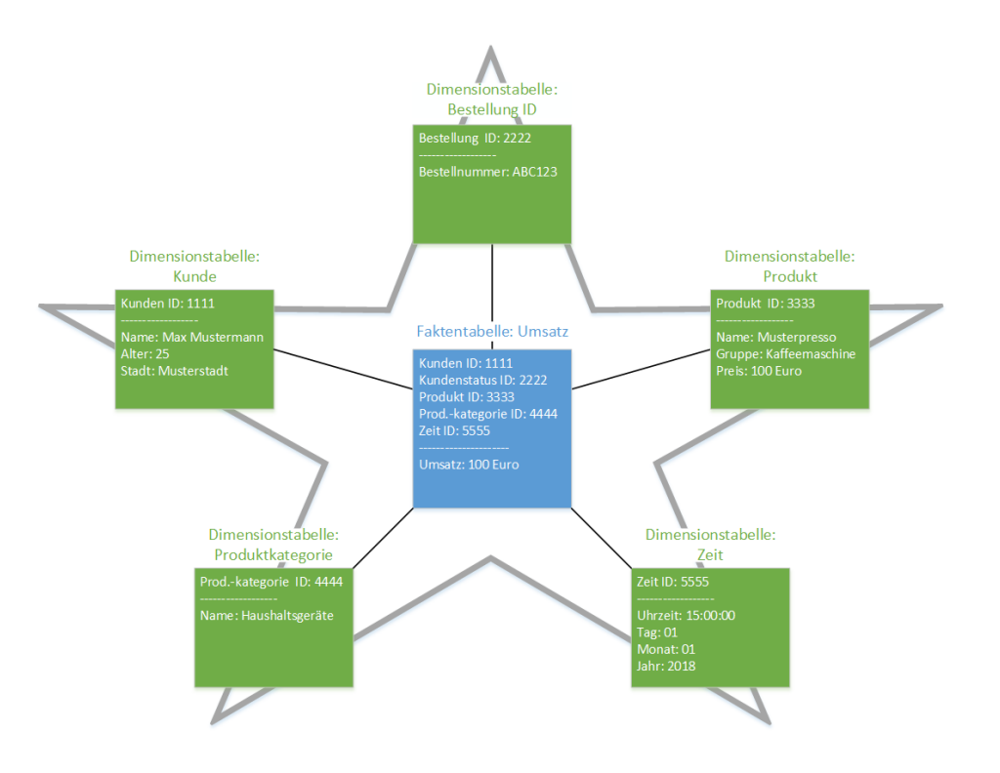
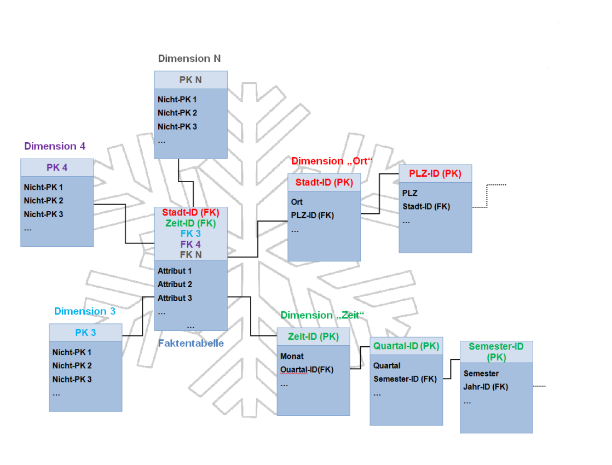

= Datawarehouse

https://davidenkovic.github.io/school-notes/datawarehouse.html[mitschrift von dave]

== Was ist Data Warehouse?

*Antwort:* +
Eine physische Datenbank mit integrierter Sicht auf beliebige Daten zu
Analysezwecken.

== Was sind die Hauptprozesse von Data Warehouse?

*Antwort:* +

* Datenbeschaffung
* Datenhaltung
* Datenversorgung
* Datenauswertung

== Was ist OLTP und OLAP

*Antwort:* +

Oltp -> online transaction protokoll (write, update, delete)

 * ist im überreich von MB bis GB groß

Olap -> online analytic protokoll (select statements)

 * ist im überreich von GB bis TB groß

== Beispiele für OLTP und OLAP

*Antwort:* +

OLTP: Buchen eines Flugs in einem Flugreservierungssystem

OLAP: Analyse der Auslastung von Transatlantikflüge der letzten zwei Jahre

== Was ist ein Sternschema

*Antwort:* +
Datenbankstruktur mit einer Basistabelle, um die sternenförmig die
Referenztabellen angeordnet sind. Es besteht aus einer Basistabelle und mehreren Referenztabellen.

Basistabelle -> Faktentabelle +
Referenztabellen -> Dimensionstabellen

== Was ist ein Schneeflockenschema

*Antwort:* +
Normalisierte Weiterführung vom Sternschema

