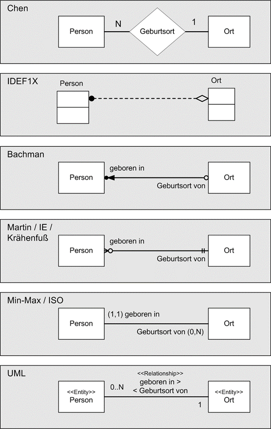

= Datenmodellierung

== Was ist Datenmodellierung

*Antwort:* +
Es dient als visuelle Darstellung von Datenobjekten und zuordnungen

== Was ist ein ER-Model

*Antwort:* +
Entity-Relationship-Modell und dient als Grundlage für einen Datenbankentwurf

== 1:1 Beziehung

*Antwort:* +
Jedem Datensatz aus der Tabelle A ist nur ein passender Datensatz der Tabelle B zugeordnet.

== 1:n Beziehung

*Antwort:* +
In einem Datensatz können in der Tabelle A mehrere passende Datensätze der Tabelle B eindeutig zugeordnet sein, aber in einem Datensatz der Tabelle B nie mehr als ein Datensatz der Tabelle A

== m:n Beziehung

*Antwort:* +
in Tabelle A können mehrere passende Datensätzen in Tabelle B zugeordnet sein und umgekehrt.

== Welche Notation gibt es?

*Antwort:* +

== Was sind Redundanzen?

*Antwort:* +
Redundanzen in Datenbanken sind ein Zeichen für ein schlechtes Datenbankdesign zum
Beispiel doppelte Informationen in einer Datenbank.

== Was ist eine redundanzfreien Datenbank?

*Antwort:* +
Wenn alle doppelte Informationen entfernt werden können, ohne das ein Informationsverlust stattfindet

== Was wäre eine Lösung?

*Antwort:* +
Die Normalisierung

== Wie lautet die Nullte Normalform?

*Antwort:* +
Alle Informationen eine Tabelle sind vorhanden und noch unnormalisiert. (CSV Tabelle)

== Wie lautet die Erste Normalform (1NF)?

*Antwort:* +
Ist gegeben, wenn alle Informationen in einer Tabelle atomar vorliegen
bedeutet, dass jede Information innerhalb einer Tabelle eine eigene Tabellenspalte
bekommt

== Wie lautet die Zweite Normalform (2NF)?

*Antwort:* +
Ist erfüllt, wenn sie in der ersten NF ist und wenn jedes Nichtschlüsselattribut von jedem Schlüsselkandidaten voll funktional abhängig ist.

== Wie lautet die Dritte Normalform (3NF)?

*Antwort:* +
Ist erfüllt, wenn sie in der ersten und zweiten NF ist und wenn kein Nichtschlüsselattribut von nur einem Teilschlüsselattribute abhängt

== Was sind Anomalien in Datenbanken?

*Antwort:* +
Sie treten bei nicht normalisierter Datenbank auf.

* Einfüge(Insert)-Anomalie
* Änderungs(Update)-Anomalie
* Lösch(Delete)-Anomalie

