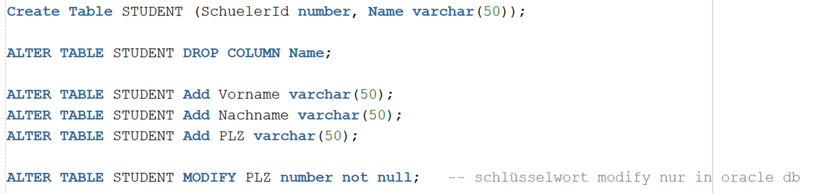

= DCL & DDL

== Was bedeutet DDL?

*Antwort:* +
Data Definition Language

* beschreiben
* ändern
* entfernen

== Wie erstellt man Tables?

*Antwort:* +

== Wie Droppt man Tables?

*Antwort:* +

== Wie Löscht man etwas von einer Tabelle?

*Antwort:* +

== Was sind Constraints?

*Antwort:* +

Spezielle Bedingungen

== Nenne Constraints

*Antwort:* +

* Primary Key
* Foreign Key
* Not Null
* Unique
* Check
* Default
* Create Index

== Wie kann man Tables bearbeiten?

*Antwort:* +
``Alter Table``

== Wie löscht man Daten aus einer Tabelle aber nicht die Tabelle?

*Antwort:* +
``Truncate``

== Was erstellt man mit View?

*Antwort:* +
Man erstellt eine virtuelle Tabelle

== Was ist ein Index?

*Antwort:* +

* Inhaltsverzeichnis
** für schnellere abfrage
* Ständig aktualisiert
* Clustered Indexes
** sortiert nach Primary Key aufsteigend
* Non Clustered Indexes
** sortiert nach Referenzen für ein spezielles Feld

== Wie erstellt man einen Index?

*Antwort:* +

== Was bedeutet DCL?

*Antwort:* +
Data Control Languaage

* Datenüberwachungssprache
* Berechtigungen
** vergeben
** entziehen

== Wie kann man rechte zuweisen?

*Antwort:* +
``Grant``

== Auf was kann man alles Rechte verteilen?

*Antwort:* +

== Wie kann man Rechte zurückrufen?

*Antwort:* +
``Rewoke``

