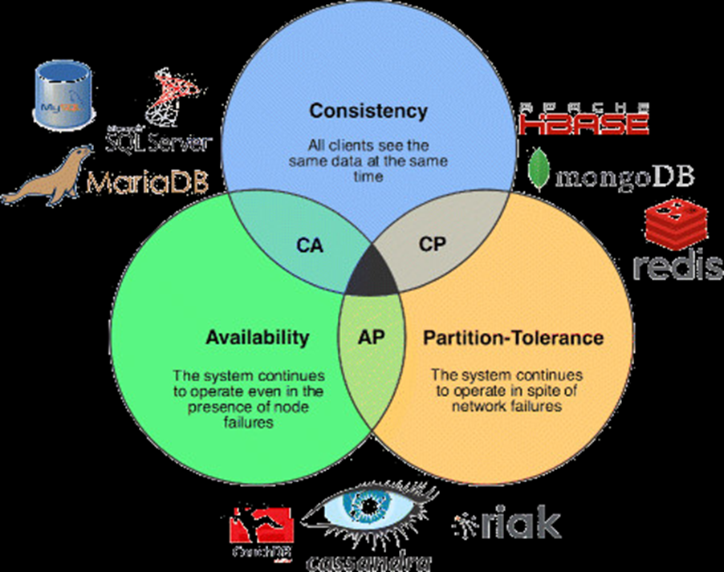
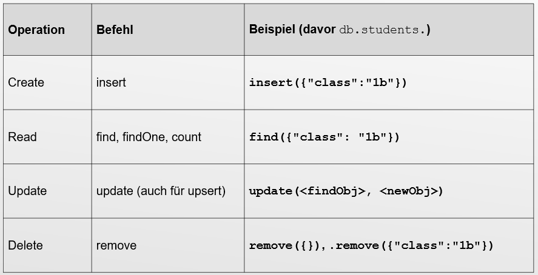

= NoSQL

== Was bedeutet NoSQL

*Antwort:* +

Not Only SQL +
Datenbanksystem mit nicht-relationalem Ansatz

==  Was ist die CAP-Theorem?

*Antwort:* +

* Konsistenz
** Jeder Leser bekommt die aktuellsten Daten
* Verfügbarkeit
** Man bekommt immer eine Antwort
* Ausfalltoleranz
** System arbeitet auch weiter, wenn Nachrichten zu spät (oder gar nicht) ankommen
* Ein System kann nicht alle 3 gleichzeitig garantieren

== Welche Grundbefehle gibt es für MongoDB

*Antwort:* +

Datenbank anlegen und verwenden: +
``use insydb``

Collection anlegen +
``db.createCollection(“students”);``

Hilfe anzeigen +
``db.students.help();``

== CRUD

*Antwort:* +

