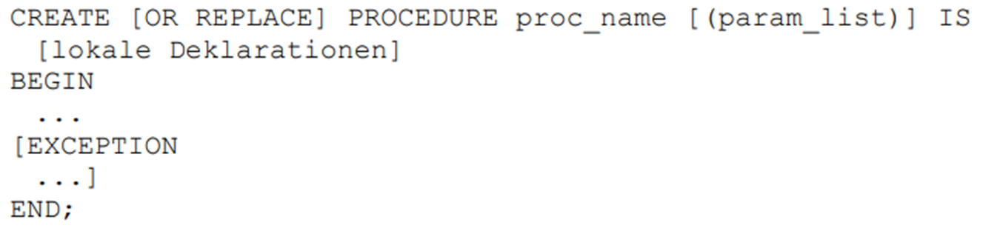
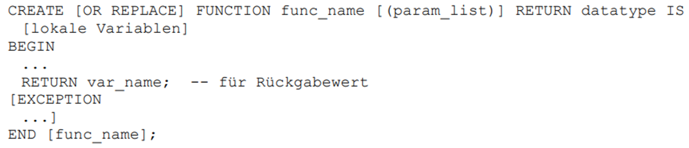
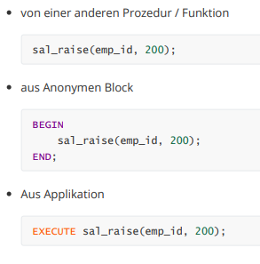
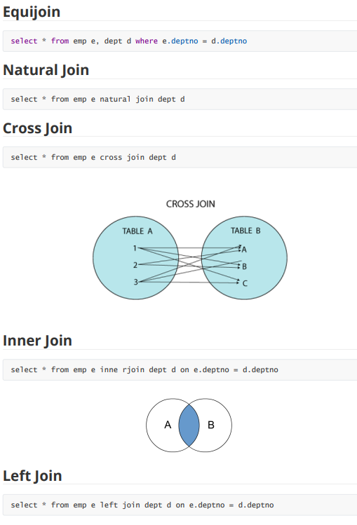
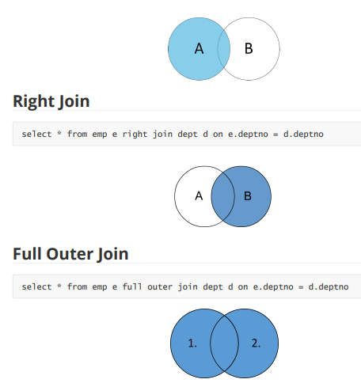

= PL/SQL und SQL

== Was ist eine Prozedur?

*Antwort:* +
SQL Block ohne return.

== Was ist eine Funktion?

*Antwort:* +
SQL Block mit return.

== Was ist ein Package?

*Antwort:* +
Ist eine benannte Sammlung von Prozeduren, Funktionen, Typen und Variablen.

== Wie führt man Prozeduren oder Funktionen aus

*Antwort:* +

== Joints

*Antwort:* +

