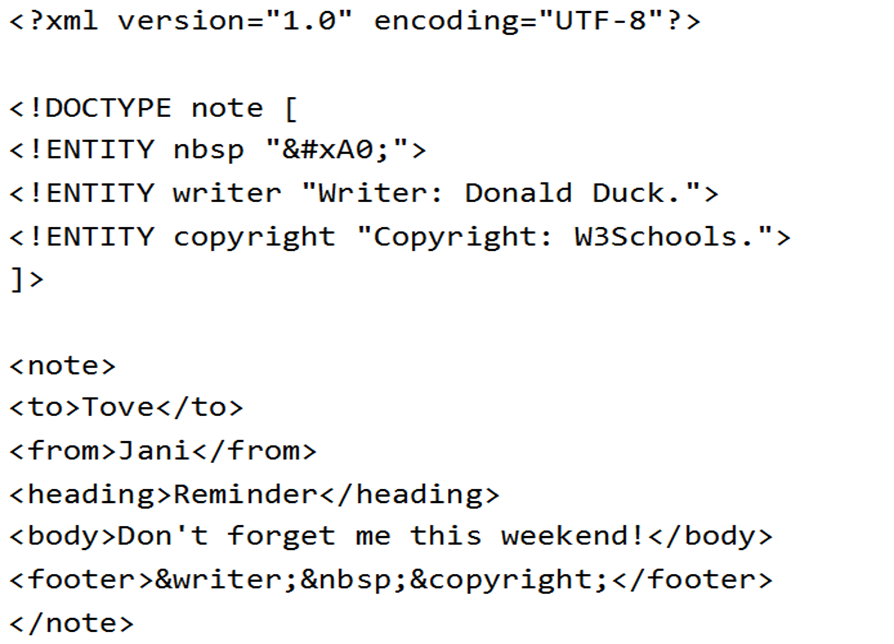

= XML

====
Die Extensible Markup Language abgekürzt XML, ist eine Auszeichnungssprache zur Darstellung
hierarchisch
strukturierter Daten im Format einer Textdatei, die sowohl von Menschen als auch von
Maschinenlesbar ist.
====

== Was bedeutet XML?

*Antwort:* +
Executable Markup Language

== Was ist der nachfolger von XML?

*Antwort:* +
JSON

== Auf was basiert XML?

*Antwort:* +
HTML

== Für was wird XML verwendet?

*Antwort:* +
Datentausch über das Internet. Es wurde designed um Daten zu befördern und nicht zu
veranschaulichen.

== Gibt es Vordefinierte Tags und was sind Vordefinierte Tags?

*Antwort:* +
Nein. Vordefinierte Tags sind zum Beispiel 
 oder <h1>.

== Was bedeutet DTD (Document Type Definition)?

*Antwort:* +
Definiert die Regeln für ein XML Dokument. Definiert die Struktur und die Elemente und Attribute eines XML-Dokuments.

== Wie werden Entities definiert in DTD?

*Antwort:* +

== Welche alternative gibt es zu DTD?

*Antwort:* +
XML-Schema

== Welche vorteile gibt es dadurch?

*Antwort:* +

* in XML geschrieben
* Unterstützt Datentypen
* Unterstützt XML Namespaces
* Erweiterbar

== Was bedeutet SVG?

*Antwort:* +
Scalable Vector Graphics

== Für was SVG?

*Antwort:* +
Es ist eine XML basierte Markup Language um 2D Grafiken zu visualisieren.

== Was bedeutet AJAX?

*Antwort:* +
Asynchronous JavaScript And XML

== Was mach AJAX?

*Antwort:* +
Es Updated eine webpage ohne sie selber neu zu laden und holt neue Daten vom Server.
Nicht nur bekommt die Seite neue Daten, sondern sie schickt sie auch im Hintergrund.

== Was bedeutet DOM?

*Antwort:* +
Document Object Model

== Was macht DOM?

*Antwort:* +
Es ist ein Standardobjektmodell für XML, welches ein XML-Dokument als Baumstruktur darstellt.

== Was bedeutet SAX?

*Antwort:* +
Simple Api for XML

== Was macht SAX

*Antwort:* +
Ist eine ereignisorientierte Schnittstelle zum Parsen von XML-Dokumenten.
Im Unterschied zu DOM ist sie ereignisorientiert.

== Was sind Elemente?

*Antwort:* +
Elemente können Text oder weitere Elemente beinhalten.

== Was ist ein Tag?

*Antwort:* +
Tags werden verwendet um Elemente auszuzeichnen.

* Starttags -> Beginn eines Elements
* Endtags -> Ende eines Elements
* leertags -> Element ohne Inhalt

== Wan ist ein XML Dokument gültig?=

*Antwort:* +
Wenn das Dokument wohlgeformt ist (DTD, XML-Schema)

== Was ist ein Parser?

Liest XML Dateien aus und prüft diese eventuell

